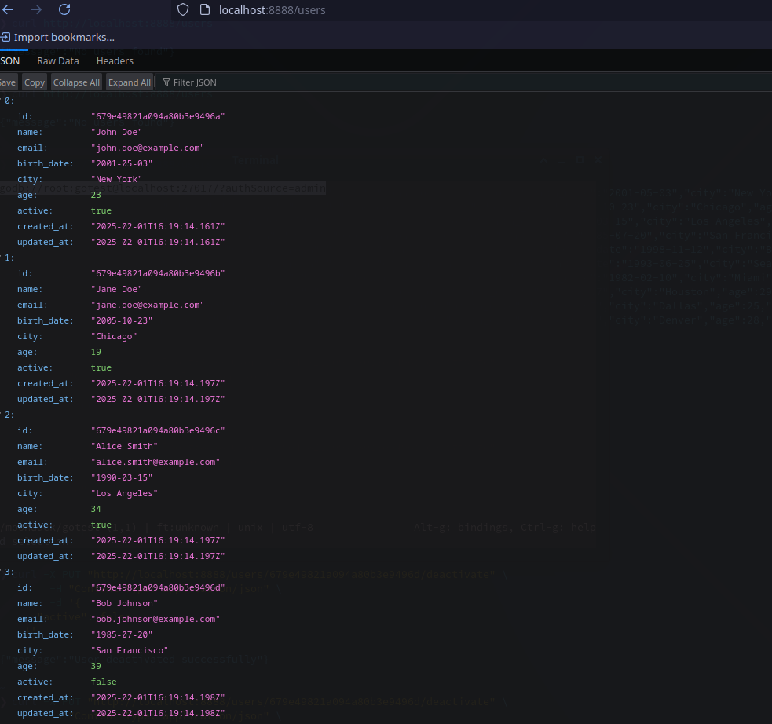
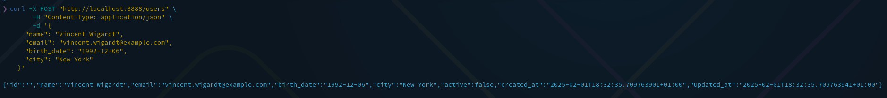
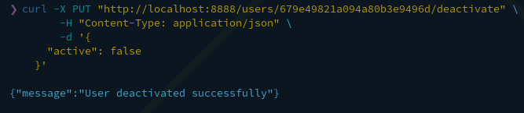
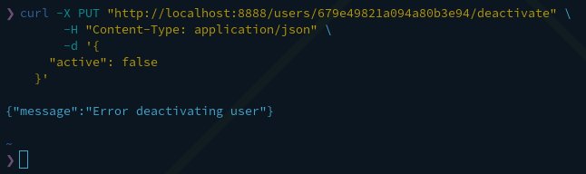
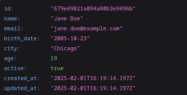

A simple backend app

Instructions

How to Start the Service

Ensure you have Docker Compose installed on your system.

Open a terminal and navigate to the root directory of the project.

Run the following command to start the service:

docker-compose up -d

The MongoDB database will now be running locally, and the seed.js file will populate the userdb database with user data.

Navigate to the cmd/app directory:

cd cmd/app

Run the Go application:

go run main.go

The service is now up and connected to the database.

Testing the Database

To check if the database is running, use the following command:

curl -X GET http://localhost:8080/users

or open the URL in a browser.

Creating a User

To create a new user, run:

curl -X POST "http://localhost:8888/users" \
     -H "Content-Type: application/json" \
     -d '{
       "name": "Vincent Wigardt",
       "email": "vincent.wigardt@example.com",
       "birth_date": "1992-12-06",
       "city": "New York"
     }'

     

Deactivating a User

To deactivate a user, replace <USER_ID> with the actual user ID and run:

curl -X PUT "htt

p://localhost:8888/users/<USER_ID>/deactivate" \
     -H "Content-Type: application/json" \
     -d '{
       "active": false
     }'

if the id dont exist it will say

Sorting Users

You can sort users by different parameters using query parameters in the browser:

Sort by email (descending order):http://localhost:8888/users?sortBy=email&order=desc

Sort by name (ascending order):http://localhost:8888/users?sortBy=name&order=asc

Sort by age (young to old):http://localhost:8888/users?sortBy=age&order=desc

Sort by age (old to young):http://localhost:8888/users?sortBy=age&order=asc

Now your service should be running and ready to handle requests!

it also calculates the age :)

Thats it for me!